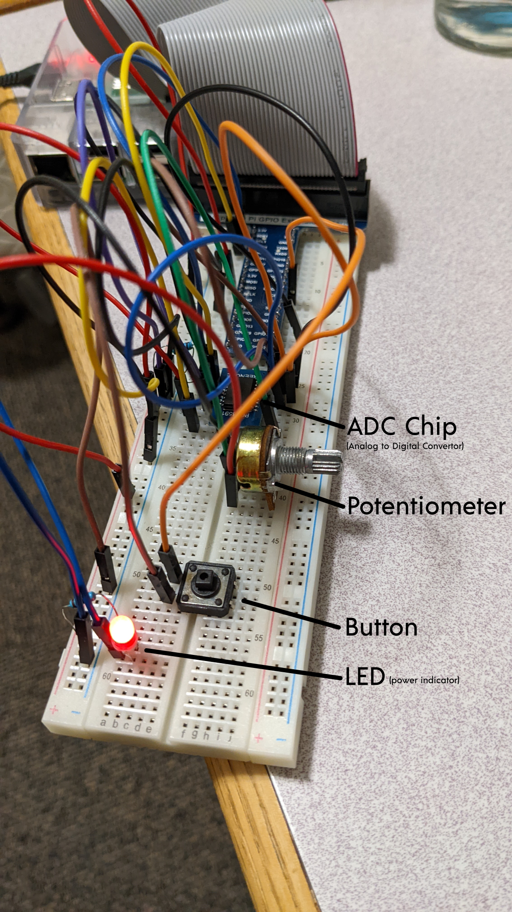

# godboard
The only keyboard you'll ever need.

## What is godboard?
Cheap, efficient and appeals to the best part about keyboards: knobs. You wanted knobs on your keyboard? Well this keyboard is literally just one knob 
and a button. Welcome to the future of keyboards.

 
*Better quality video: https://www.youtube.com/watch?v=n0uDG7jGtX0*

Will soon be accepting venture capital funds. 🤑🤑🤑

In the meantime, how about a cup of coffee?
https://www.buymeacoffee.com/frankwhoee

## How does this marvel of modern invention work?
I'm glad you asked, and thanks for the compliment. Using a potentiometer, we can let the user adjust resistance through a knob, which we can measure by the 
voltage coming out in analog form. This is sent to an ADC chip that converts this analog data to a digital signal that is sent to a Raspberry Pi. We 
record the volts in software and convert that to characters. We also listen for the button press on GPIO pin 25 to confirm using the current character.

## What's next for this revolutionary technology?
* Add USB support so it can be recognized as an actual keyboard
* Add a fancier knob with labels. And a fancier button. With a real keycap.
* Raise a billion in investments
* RGB.
* Start manufacturing
* Become the biggest tech company in the world
* Be acquired by Microsoft
* Retire at age 40
* Buy a hotdog stand with acquisition money
* Move hotdog stand to Bahamas
* Sell hotdogs to myself for the rest of my life.
